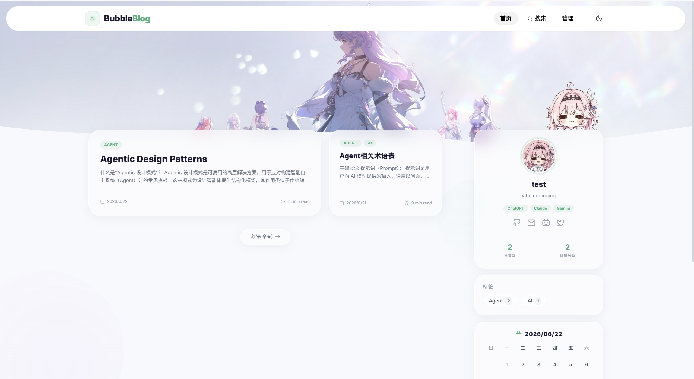
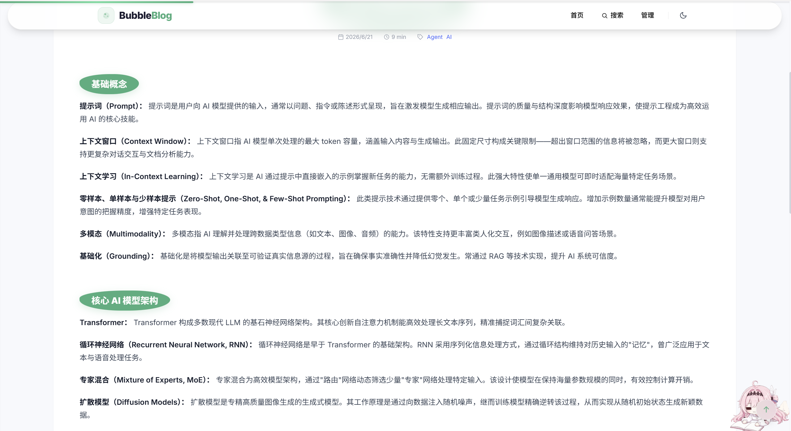
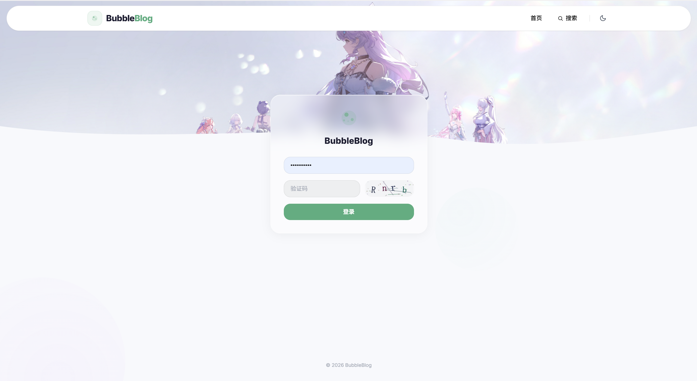
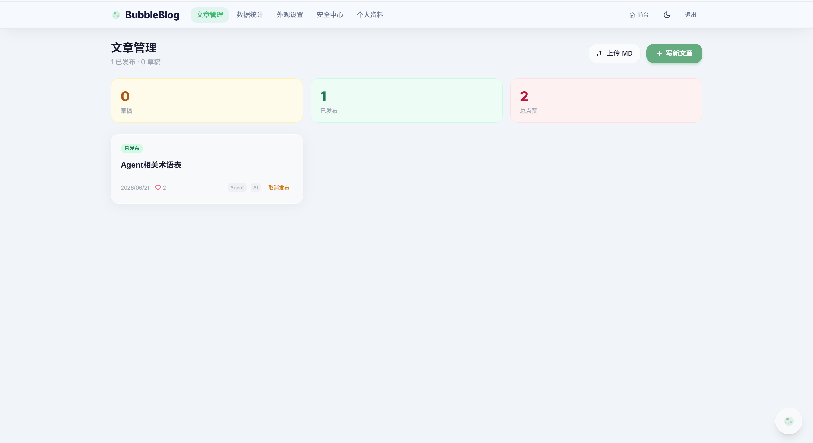
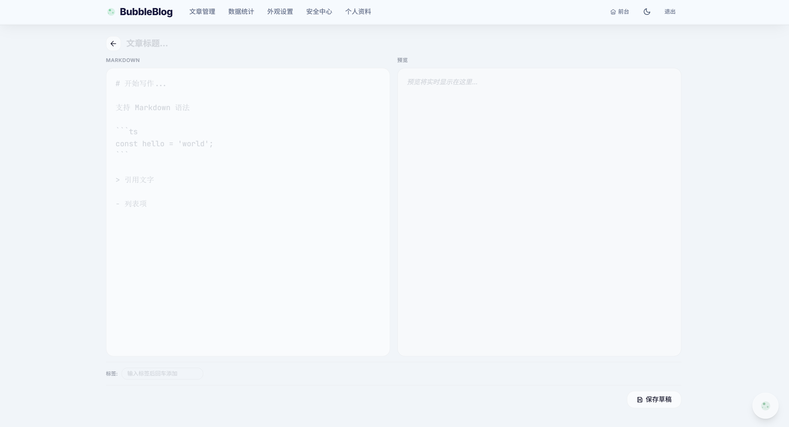
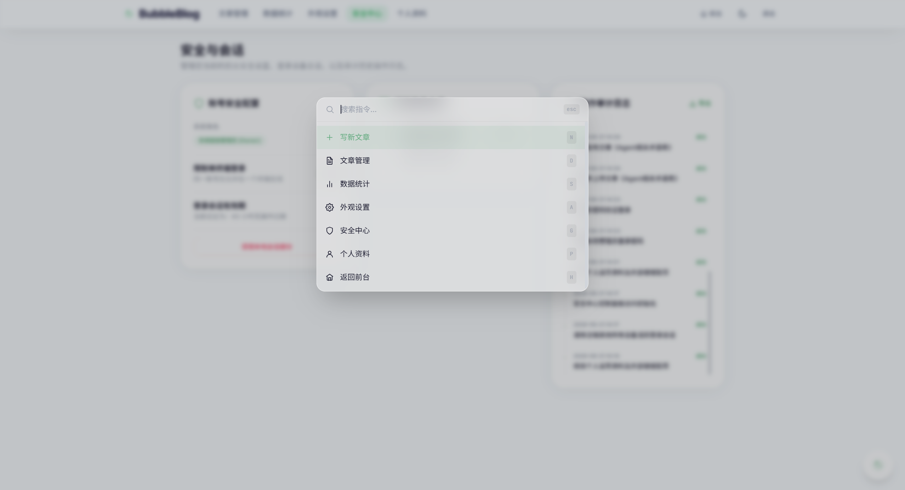

## 项目截图

  
  
<strong>主页效果</strong>

---

  
  
<strong>阅读界面</strong>

---

  
  
<strong>登录界面</strong>

---

  
  
<strong>博客管理</strong>

---

  
  
<strong>网页写作</strong>

---

  
  
<strong>设置</strong>

